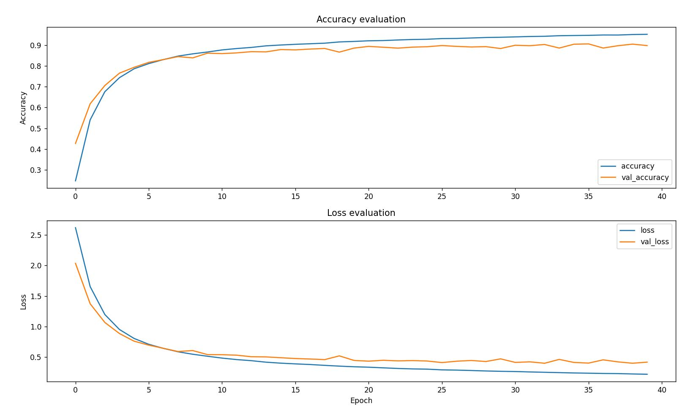
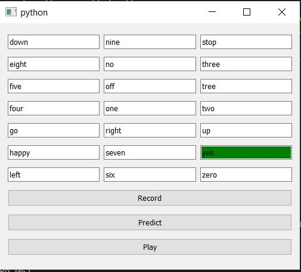

# Speech-recognition-system

to download data set click [here](https://ai.googleblog.com/2017/08/launching-speech-commands-dataset.html)

The dataset has 65,000 one-second long utterances of 30 short words (I used only 20), by thousands of different people, contributed by members of the public through the AIY website. It’s released under a Creative Commons BY 4.0 license, and will continue to grow in future releases as more contributions are received. The dataset is designed to let you build basic but useful voice interfaces for applications, with common words like “Yes”, “No”, digits, and directions included. The infrastructure we used to create the data has been open sourced too, and we hope to see it used by the wider community to create their own versions, especially to cover underserved languages and applications.

These are the Loos and Acuraacy eveluation graphs

So to Use the Desktop Application run the "PyQT Desktop Application\command recognition Application.py" 
you will see window shown below

Press "Record" button and say a word shown in boxes (keep in mind recording will be of One second only)

To check weather the model predict the recorded data well or not press "Predict" button and you can listen what you have recorded by using "play" button.